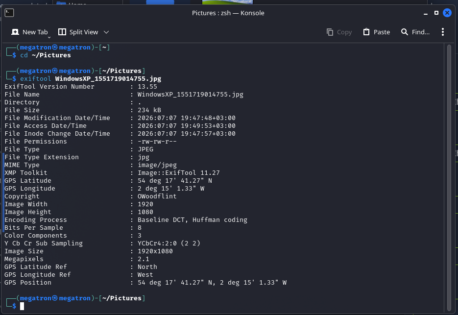
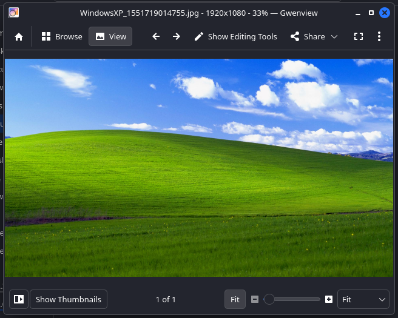
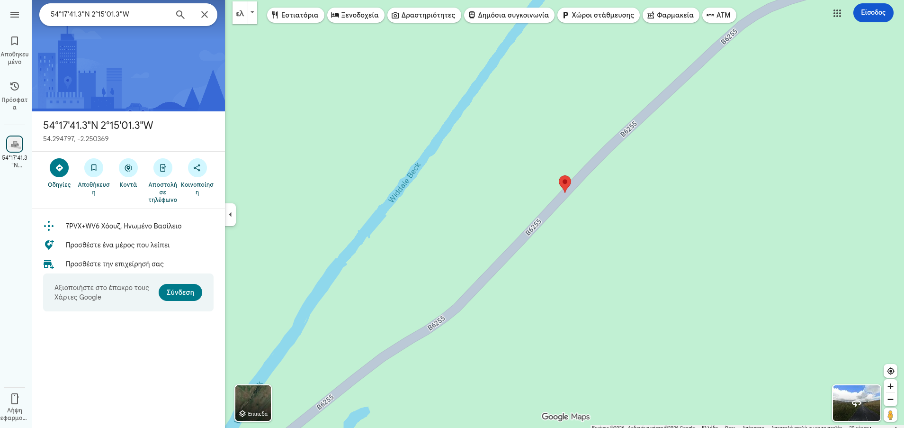
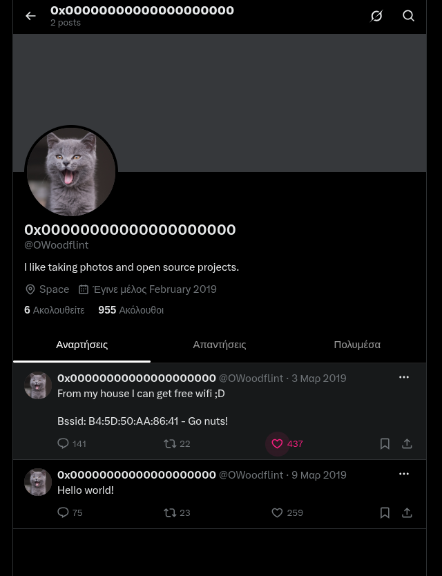
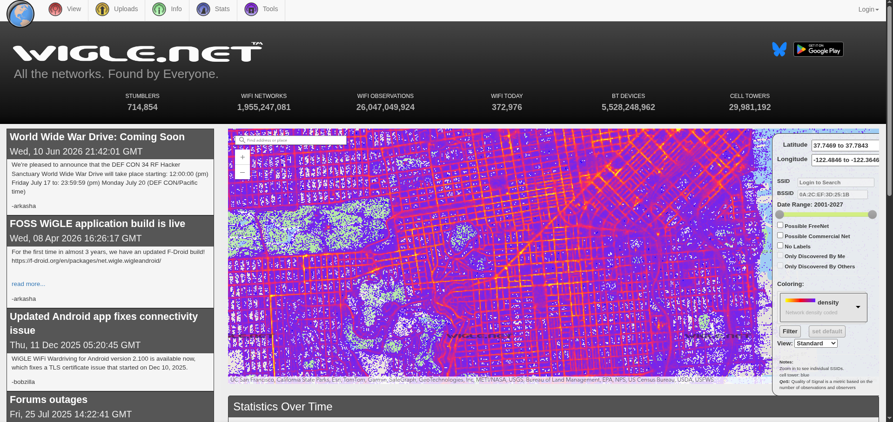
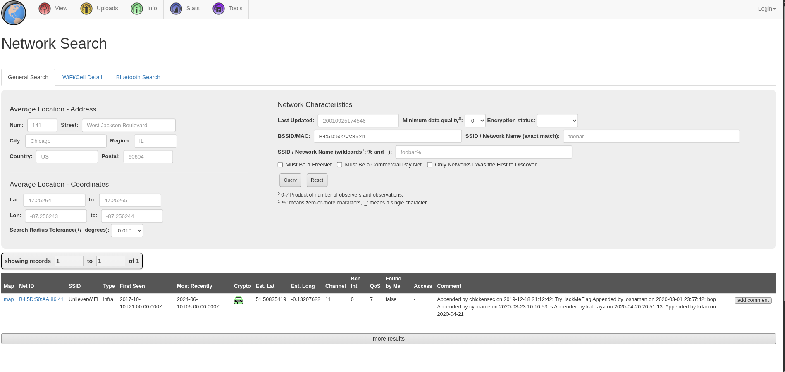
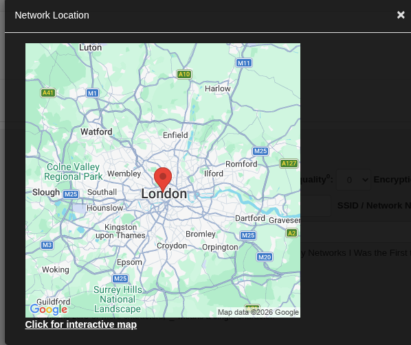
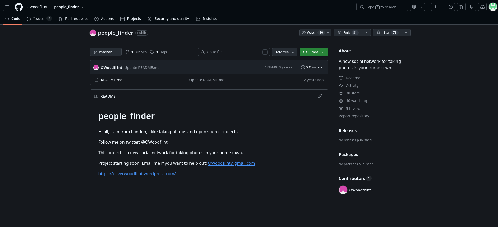
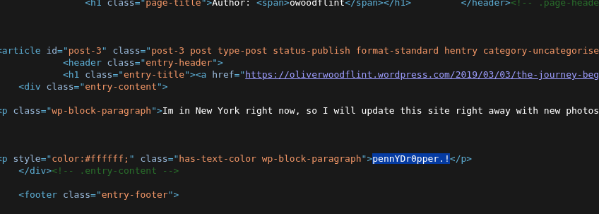

# OhSINT — TryHackMe

**Room:** [OhSINT](https://tryhackme.com/room/ohsint)
**Category:** OSINT (Open Source Intelligence)
**Difficulty:** Easy
**Tools used:** `exiftool`, Google, X/Twitter, Google Maps, WiGLE.net, GitHub, WordPress, browser dev tools

## Overview

OhSINT is a beginner-friendly OSINT room that demonstrates how much information can be pulled from a single image file, and how that information can be chained together across the internet to build a full profile of a person. The room provides one image and asks a series of questions that must be answered by following the digital breadcrumbs left in the file's metadata.


---

## Task 1 — Investigating the image

**Question:** What information can you possibly get with just one image file?

Metadata embedded in an image (EXIF data) can reveal far more than the picture itself — GPS coordinates, timestamps, device information, and in this case, a copyright field containing a username.

### Step 1 — Extract metadata with exiftool

I downloaded the task file (`WindowsXP_1551719014755.jpg`) and ran `exiftool` against it:

```bash
cd ~/Pictures
exiftool WindowsXP_1551719014755.jpg
```



The output revealed:
- **GPS Latitude:** 54 deg 17' 41.27" N
- **GPS Longitude:** 2 deg 15' 1.33" W
- **Copyright:** `OWoodflint`

Opening the image itself in Gwenview just showed a Windows XP–style "Bliss" wallpaper (green hills, blue sky) — nothing hidden in the picture visually, so the real clues had to come from the metadata.



I also plugged the raw GPS coordinates from the EXIF data straight into Google Maps to see where they pointed.



This pin landed in a rural spot in northern England (near Widdale Beck), nowhere close to the city the later questions confirm — a reminder that EXIF GPS data can be inaccurate, spoofed, or simply irrelevant to the real target, and shouldn't be trusted at face value.

---

### Q1: What is this user's avatar of?
**Answer:** `cat`

The `Copyright` field from the EXIF data (`OWoodflint`) looked like a username. Searching for it on Google surfaced an X (Twitter) account, [@OWoodflint](https://x.com/OWoodflint), whose profile picture is a cat.




---

### Q2: What city is this person in?
**Answer:** `London`

On the same X profile, one of the two posts read:

> From my house I can get free wifi ;D
> Bssid: B4:5D:50:AA:86:41 - Go nuts!

A BSSID is the MAC address of a wireless access point, and access points can be geolocated using wardriving databases. I took this BSSID to [WiGLE.net](https://wigle.net) and used the **Network Search** tool.



Searching the BSSID `B4:5D:50:AA:86:41` returned a match with an estimated location in **London**.




---

### Q3: What is the SSID of the WAP he connected to?
**Answer:** `UnileverWiFi`

The same WiGLE.net query that resolved the location also returned the network's SSID in the results table (see screenshot above).

---

### Q4: What is his personal email address?
**Answer:** `OWoodflint@gmail.com`

Going back to Google and searching the username `OWoodflint` more broadly turned up a GitHub profile with a repository called `people_finder`. Its README listed a contact email address.



---

### Q5: What site did you find his email address on?
**Answer:** `Github`

The email address was published directly in the GitHub repository's README file, as shown above.

---

### Q6: Where has he gone on holiday?
**Answer:** `New York`

The GitHub README also linked to a personal WordPress blog. On the blog's author page, a post titled "Hey" stated:

> Im in New York right now, so I will update this site right away with new photos!


---

### Q7: What is the person's password?
**Answer:** `pennYDr0pper.!`

Nothing on the rendered blog page hinted at a password. Right-clicking and selecting **View Page Source** revealed a hidden paragraph styled with white text (`color:#ffffff`) — invisible on the page itself but plainly visible in the raw HTML.



---

## Room Completed


---

## Key Takeaways

- **Metadata is often more revealing than the file itself.** A single innocuous-looking image can leak GPS coordinates, device info, and identifying strings via EXIF fields like `Copyright`.
- **Don't trust EXIF GPS blindly.** The coordinates embedded in the image pointed to an unrelated rural location — a good reminder to cross-check geodata against other evidence rather than treating it as ground truth.
- **BSSIDs are geolocatable.** Public wardriving databases like WiGLE.net can map a Wi-Fi access point's MAC address to a real-world location, even years after the original scan.
- **OSINT is about chaining small clues.** A username on one platform led to an X account, which led to a GitHub profile, which led to a personal blog — each site contributing one piece of the puzzle.
- **Always check page source.** Sensitive information (like the hidden password here) can be concealed visually with CSS but remains fully readable in the raw HTML.
